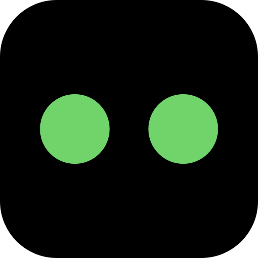

<p align="center">
  
</p>

# Notch Pilot

A live companion for [Claude Code](https://docs.claude.com/en/docs/claude-code) that lives in your MacBook's notch.

When Claude is working, a little buddy peeks out of the notch and reacts to what's happening — blinks while thinking, narrows its eyes while editing, goes wide-eyed red when something dangerous is about to run. Hover the notch to see all your running sessions, jump to their terminals, handle permission prompts, and watch today's activity as a heatmap.

## Features

- **Live notch presence.** A buddy slides out of the notch the moment `claude` starts in any terminal and fades away 10 seconds after the session ends.
- **Six styles, six colors.** Eyes, orb, waves, ghost, cat, bunny × orange, blue, green, purple, pink, cyan. Click the buddy face in the expanded panel to switch.
- **Reactive moods.** Editing files → focused. Running shell → active. `rm -rf` / `DROP TABLE` / `sudo` → wide-eyed shock. Permission needed → curious. Session ending → content.
- **Permission prompts in the notch.** A hook intercepts every `PermissionRequest` and surfaces a structured view of what the tool wants to do — shell command, file diff, URL, pattern — with `Deny`, `Allow`, and `Always allow <Tool>`. "Always allow" writes to `~/.claude/settings.json` so Claude Code honors it natively next time.
- **Session panel.** Hover the notch to see every live session with project, model, uptime, and permission mode. One click jumps to the hosting terminal (tmux-aware). 24-hour activity heatmap, allow-list manager, and filter bar all live here.
- **Voice announcements.** Optional, per event (permission / danger / session started / session finished). Off by default.
- **No menu bar, no dock icon.** The notch is the entire surface. Quit lives on a power button in the expanded panel header.

## Install

### Homebrew (recommended)

```sh
brew install --cask devmegablaster/devmegablaster/notch-pilot
```

First launch: right-click `Notch Pilot.app` in `/Applications` → **Open** (the app is ad-hoc signed, not Developer-ID signed, so Gatekeeper needs a one-time override).

### DMG

1. Grab the latest `.dmg` from [Releases](https://github.com/devmegablaster/Notch-Pilot/releases).
2. Drag `Notch Pilot.app` to `/Applications`.
3. First launch: right-click → **Open**.

### From source

Requires macOS 14+ and Swift 5.9+.

```sh
git clone https://github.com/devmegablaster/Notch-Pilot.git
cd Notch-Pilot
./scripts/build.sh            # dist/Notch Pilot.app
./scripts/make-dmg.sh         # dist/NotchPilot-<version>.dmg
```

## Requirements

- macOS 14 (Sonoma) or later
- [Claude Code CLI](https://docs.claude.com/en/docs/claude-code)
- [Node.js](https://nodejs.org/) on `PATH` (the permission hook is a ~100-line Node script; without it the buddy still shows session activity, just can't intercept prompts)

## How it works

Notch Pilot watches two things:

1. **`~/.claude/projects/**/*.jsonl`** — Claude Code writes session transcripts here. The app tails the latest file every second, parses the last entry's `tool_use` block, and cross-references it with the live `claude` processes via `libproc` to tell which sessions are actually running.
2. **A Claude Code hook** auto-installed on first launch in `~/.claude/settings.json`. On `PermissionRequest` / `PreToolUse` / `UserPromptSubmit` it pipes the event over a Unix socket at `~/.notch-pilot/pilot.sock` to the running app. Permission requests block the hook until the user clicks allow or deny.

The UI is an `NSPanel` with an `NSHostingView` hosting SwiftUI, morphing between a collapsed pill and a full panel. The window resizes to fit content so clicks outside the pill pass through to whatever's underneath.

## Privacy

Everything runs locally. No network calls, no telemetry. The app only touches `~/.claude/projects/`, `~/.claude/settings.json`, and `~/.notch-pilot/`.

## Uninstall

1. Quit via the power button in the panel header (or `killall NotchPilot`).
2. `rm -rf /Applications/Notch\ Pilot.app`
3. `rm -rf ~/.notch-pilot`
4. Remove the hook entries from `~/.claude/settings.json` — search for `~/.notch-pilot/hook.js` and delete the surrounding matchers.

## License

MIT. See [LICENSE](./LICENSE).
