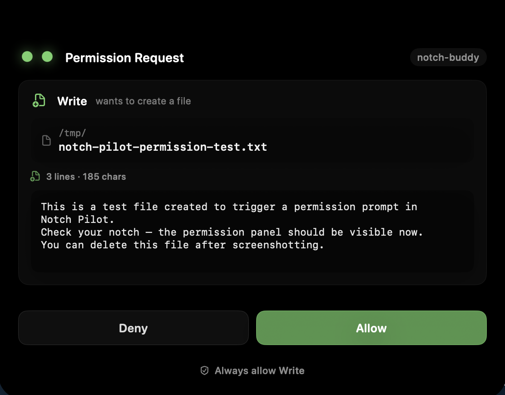
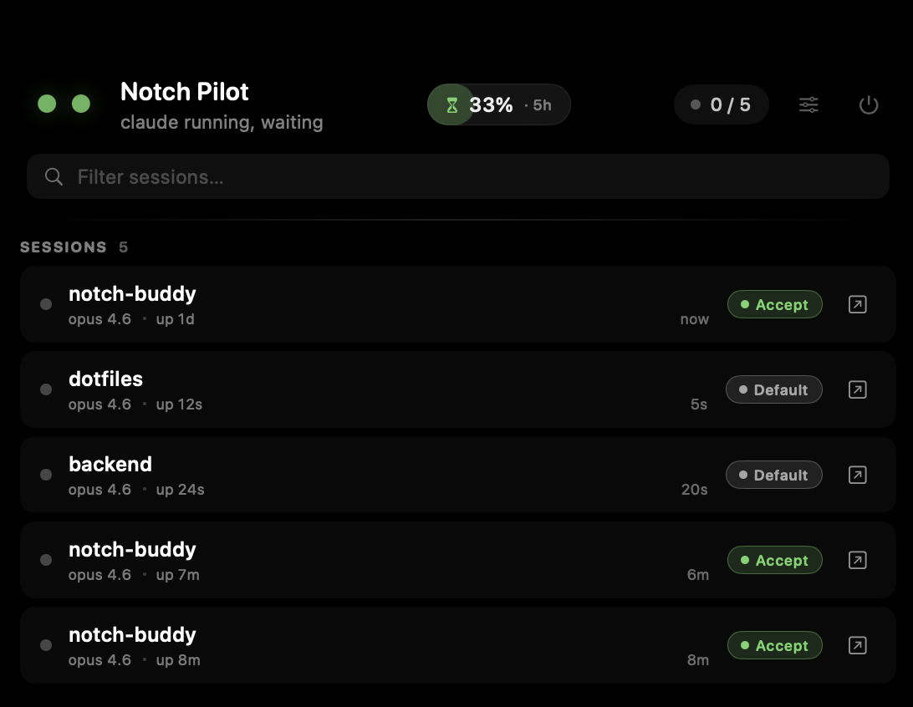
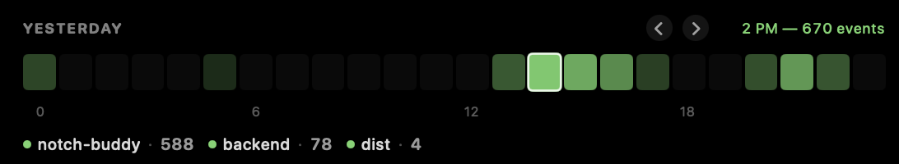

<p align="center">
  
</p>

<h1 align="center">Notch Pilot</h1>

<p align="center">
  <b>Your MacBook notch, but it's a live Claude Code dashboard.</b><br/>
  Live usage limits, session status, permission prompts, and an animated buddy — all in the hole you already stare at.
</p>

<p align="center">
  <a href="https://github.com/devmegablaster/Notch-Pilot/releases/latest"></a>
  <a href="https://github.com/devmegablaster/Notch-Pilot/blob/main/LICENSE"></a>
  
  <a href="https://github.com/devmegablaster/Notch-Pilot/stargazers"></a>
</p>

<p align="center">
  <video src="./docs/demo.mp4" width="720" controls autoplay loop muted playsinline></video>
</p>

<p align="center">
  <i>Full demo video above — if it doesn't render inline, <a href="./docs/demo.mp4">click here</a>.</i>
</p>

---

## Install

```sh
brew tap devmegablaster/devmegablaster
brew install --cask notch-pilot
```

First launch: right-click `Notch Pilot.app` in `/Applications` → **Open** (the app is ad-hoc signed, so Gatekeeper needs a one-time nod).

That's it. No menu bar icon. No dock icon. Hover the notch and the app reveals itself.

> Prefer the direct long form: `brew install --cask devmegablaster/devmegablaster/notch-pilot`

---

## What it actually does

### Live Claude usage, right in the notch

The center of the expanded panel shows your **real 5-hour session utilization %** — the same number Claude's billing page shows you, not an estimate. Click it for the full breakdown: weekly limits (all models / Sonnet / Opus), extra-credit usage, reset countdowns, and today's input/output/cache token breakdown.

This works because Notch Pilot reads the Claude Code OAuth token the same way Claude Code itself does (via the `security` CLI) and hits Anthropic's `oauth/usage` endpoint directly. Nothing ships off your machine.

<p align="center">
  
</p>

### A buddy that reacts to what Claude is doing

The collapsed pill carries one of six animated buddies — eyes, orb, waves, ghost, cat, bunny — in one of six colors. Each has seven expressions that fire based on what Claude is actually doing:

- **Focused** (narrow, steady) — editing files
- **Active** (pulsing) — running a tool
- **Curious** (darting eyes) — permission request pending
- **Shocked** (wide-eyed red) — dangerous command detected (`rm -rf /`, `DROP TABLE`, `sudo rm`, fork bombs, etc.)
- **Content** (happy blinks) — 10-second farewell after activity ends
- **Idle / Sleeping** — nothing happening

### Permission prompts without leaving your editor

When Claude asks for permission to run a command, the notch expands into a structured view of the request. Shell commands get a code block. File edits get a red/green diff. URLs get a parsed host/path split. You get **Deny**, **Allow**, and **Always allow `<Tool>`** — the "always allow" path writes to `~/.claude/settings.json` so Claude Code honors it natively next time.

`AskUserQuestion` gets the same treatment: each option becomes a clickable button.

<p align="center">
  
</p>

### See every session at a glance

Hover the notch to see every live Claude session: project name, model, uptime, permission mode. Click a session to see its recent activity — user prompts, tool calls, assistant replies, errors — as a timeline. Click the arrow to jump to the hosting terminal; **tmux pane navigation** is supported, so it selects the exact pane running Claude before activating Alacritty, Terminal, iTerm, Ghostty, Kitty, WezTerm, Warp, and friends.

<p align="center">
  
</p>

### Activity heatmap with history

A 24-hour activity strip per day, with `‹` `›` arrows to walk back through previous days. Hover any cell to see which projects were active in that hour. Useful for noticing when you actually did the work vs when you think you did.

<p align="center">
  
</p>

### Session finished? The buddy lets you know

When a Claude session wraps, the notch pops out of its hole into a bigger pill with the buddy centered and the project name below — so you can glance up from your editor and see that `notch-pilot done` without tabbing. Configurable and rate-limited; never interrupts.

---

## Other things worth mentioning

- **Auto-start at login** — registered via `SMAppService`, toggle in Behavior settings
- **Always-visible mode** — pin the buddy to the notch even when nothing's running (idle peeks + `zzz…` text, default on)
- **Haptic feedback** — a subtle `.levelChange` tick when the panel opens or closes (Force Touch trackpads only)
- **Voice announcements** — optional per-event (permission / danger / session started / session finished), off by default
- **No menu bar, no dock icon** — the notch is the entire surface. Quit lives on a power button in the expanded panel header.

---

## Requirements

- **macOS 14 (Sonoma)** or later with a MacBook notch (works on non-notched displays too, just less visually interesting)
- **[Claude Code CLI](https://docs.claude.com/en/docs/claude-code)** signed in
- **[Node.js](https://nodejs.org/)** on your `PATH` — the permission hook is a ~100-line Node script. Without it, sessions still show but permission interception won't work.

---

## How it works

Notch Pilot watches three things:

1. **`~/.claude/projects/**/*.jsonl`** — Claude Code writes session transcripts here. The app tails the latest file every second, parses the last entry's `tool_use` block, and cross-references with live `claude` processes via `libproc` to filter dead sessions.
2. **A Claude Code hook** auto-installed on first launch in `~/.claude/settings.json`. On `PermissionRequest` / `PreToolUse` / `UserPromptSubmit` it pipes the event over a Unix domain socket (`~/.notch-pilot/pilot.sock`) to the running app. Permission prompts block the hook until the user clicks allow or deny.
3. **Anthropic's `oauth/usage` endpoint** for the live usage percentages. Reads the Claude Code OAuth token via `/usr/bin/security find-generic-password` — the `security` CLI is on the Keychain credential's ACL allow-list, so reads succeed silently without password prompts.

The UI is an `NSPanel` hosting SwiftUI via `NSHostingView`, morphing between a collapsed pill and a full panel. The window resizes to fit content so clicks outside the pill pass through to whatever's underneath.

---

## Privacy

Everything runs locally. No analytics, no telemetry, no network calls other than Anthropic's own usage endpoint (which Claude Code already uses on your behalf). The app only touches:

- `~/.claude/projects/` (read — session transcripts)
- `~/.claude/settings.json` (read/write — installs the permission hook)
- `~/.notch-pilot/` (read/write — hook script + Unix socket)
- macOS Keychain item `Claude Code-credentials` (read — via the `security` CLI, the same way Claude Code uses it)

No account, no sign-up, no server-side anything.

---

## Uninstall

```sh
brew uninstall --cask notch-pilot
rm -rf ~/.notch-pilot
```

Then open `~/.claude/settings.json` and delete any `hooks` entries that reference `~/.notch-pilot/hook.js`.

---

## Build from source

Requires macOS 14+ and Swift 5.9+ (ships with Xcode Command Line Tools).

```sh
git clone https://github.com/devmegablaster/Notch-Pilot.git
cd Notch-Pilot
./scripts/build.sh         # produces dist/Notch Pilot.app
./scripts/make-dmg.sh      # produces dist/NotchPilot-<version>.dmg
```

No external dependencies. Everything's the standard library + Apple frameworks.

---

## Contributing

PRs welcome — especially new buddy styles, colors, and platform integrations. See [CONTRIBUTING.md](./CONTRIBUTING.md) for the short guide on adding a new buddy.

## License

MIT. See [LICENSE](./LICENSE).
